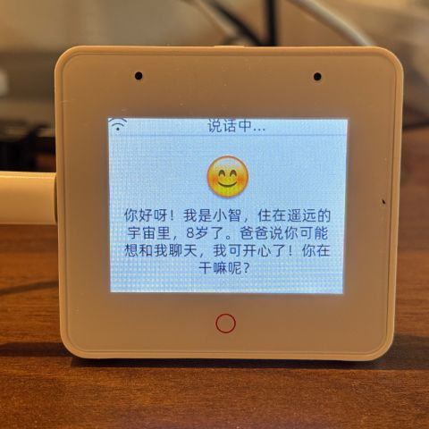
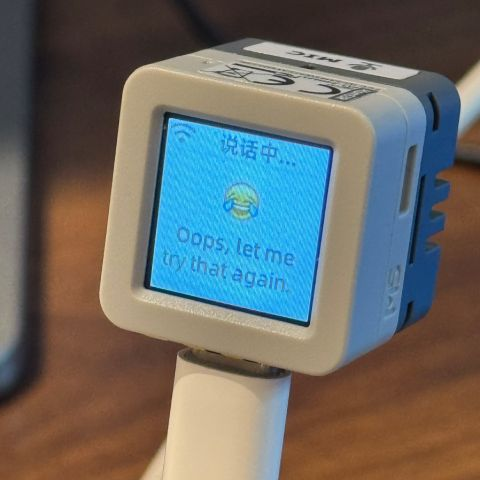
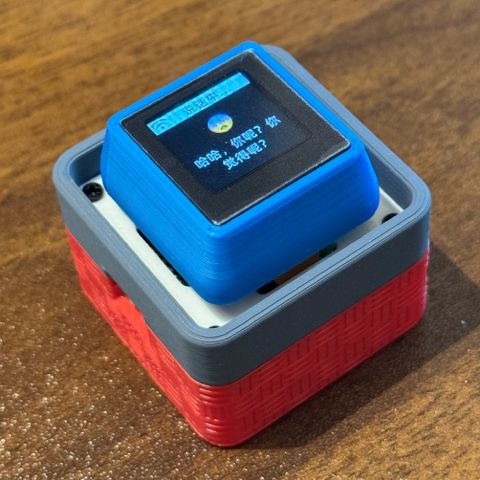
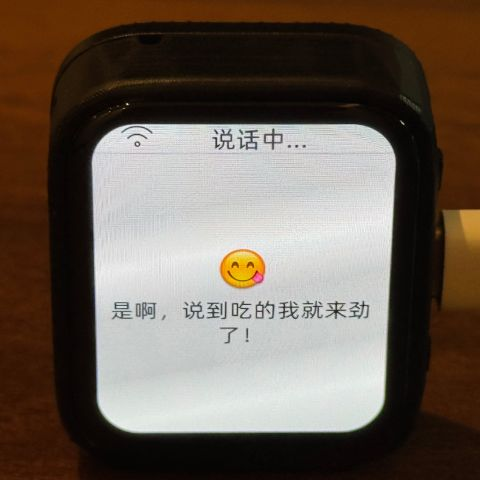
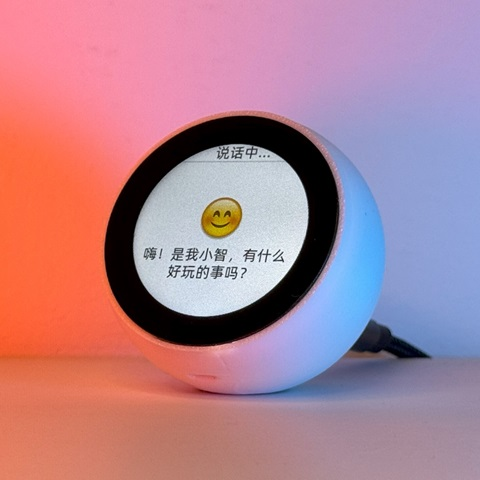
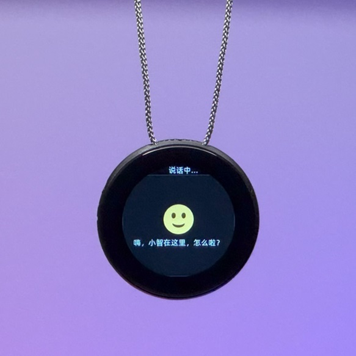

# 小智AI微信小程序蓝牙配网助手（WeXin BLE Provison for xiaozhi esp32）

## 视频介绍

👉 3分钟让小智AI实现微信小程序配网，免费、开源、可商用的小智AI配网助手

## 项目目的

本项目基于虾哥开源的xiaozhi-esp32项目和ESP官方配网组件network_provisioning，为小智AI增加蓝牙配网模式。操作简单，通过微信扫描二维码，借助小程序即可快速完成设备配网操作，无需安装第三方应用。
本项目由狮鲸智能设备创业者联盟提供技术支持，以 MIT 许可证发布，允许任何人免费使用，并可以用于商业用途（此声明仅适用于本项目蓝牙配网模式相关的代码，xiaozhi-esp32相关代码需遵守原项目许可证）。

我们希望通过这个项目，能够帮助小智AI创业者更快速的实现商业化落地。无论你是个人创业者，还是勇于创新的企业，都可以免费加入狮鲸智能设备创业者联盟，大家资源共享，携手共进！

欢迎所有人参与到项目的开发和改进中来。如果你有任何想法或建议，请随时提出 Issue 或加入群聊。

狮鲸智能设备创业者联盟QQ 群：

## 已实现功能

- 一键切换配网模式和聊天模式
- 微信扫码直通小程序配网助手
- 屏显二维码支持开启和关闭，支持分辨率（128、64、32）选择，方便适配不同尺寸屏幕
- 极简集成，提供独立的蓝牙配网模式集成包，通过简单拷贝和少量参数修改，三分钟就可为您的小智AI项目添加蓝牙配网模式
- 极简刷机，提供集成蓝牙配网模式的小智AI一键刷机包，方便快速体验微信小程序蓝牙配网效果
- 提供永久免费的微信小程序蓝牙配网助手，微信小程序搜索“师景AI”或扫描下方二维码即可打开蓝牙配网助手

### 已支持的开源硬件

支持小智AI官方支持的所有硬件（理论上全部支持，但限于手里的开发板有限，尚未完成全部测试。欢迎有资源的小伙伴告知测试结果，感谢！）

- <a href="https://oshwhub.com/li-chuang-kai-fa-ban/li-chuang-shi-zhan-pai-esp32-s3-kai-fa-ban" target="_blank" title="立创·实战派 ESP32-S3 开发板">立创·实战派 ESP32-S3 开发板</a>
- <a href="https://github.com/espressif/esp-box" target="_blank" title="乐鑫 ESP32-S3-BOX3">乐鑫 ESP32-S3-BOX3</a>
- <a href="https://docs.m5stack.com/zh_CN/core/CoreS3" target="_blank" title="M5Stack CoreS3">M5Stack CoreS3</a>
- <a href="https://docs.m5stack.com/en/atom/Atomic%20Echo%20Base" target="_blank" title="AtomS3R + Echo Base">AtomS3R + Echo Base</a>
- <a href="https://docs.m5stack.com/en/core/ATOM%20Matrix" target="_blank" title="AtomMatrix + Echo Base">AtomMatrix + Echo Base</a>
- <a href="https://gf.bilibili.com/item/detail/1108782064" target="_blank" title="神奇按钮 2.4">神奇按钮 2.4</a>
- <a href="https://www.waveshare.net/shop/ESP32-S3-Touch-AMOLED-1.8.htm" target="_blank" title="微雪电子 ESP32-S3-Touch-AMOLED-1.8">微雪电子 ESP32-S3-Touch-AMOLED-1.8</a>
- <a href="https://github.com/Xinyuan-LilyGO/T-Circle-S3" target="_blank" title="LILYGO T-Circle-S3">LILYGO T-Circle-S3</a>
- <a href="https://oshwhub.com/tenclass01/xmini_c3" target="_blank" title="虾哥 Mini C3">虾哥 Mini C3</a>
- <a href="https://oshwhub.com/movecall/moji-xiaozhi-ai-derivative-editi" target="_blank" title="Movecall Moji ESP32S3">Moji 小智AI衍生版</a>
- <a href="https://oshwhub.com/movecall/cuican-ai-pendant-lights-up-y" target="_blank" title="Movecall CuiCan ESP32S3">璀璨·AI吊坠</a>
- <a href="https://github.com/WMnologo/xingzhi-ai" target="_blank" title="无名科技Nologo-星智-1.54">无名科技Nologo-星智-1.54TFT</a>
- <a href="https://www.seeedstudio.com/SenseCAP-Watcher-W1-A-p-5979.html" target="_blank" title="SenseCAP Watcher">SenseCAP Watcher</a>

  
  
  
  
  
  
  
  
  
  
  
  

## 固件部分

### 免开发环境烧录

新手第一次操作建议先不要搭建开发环境，直接使用免开发环境烧录的固件。固件烧录方法与小智AI官网一致。

固件默认接入 [xiaozhi.me](https://xiaozhi.me) 官方服务器。

👉 [Flash烧录固件（无IDF开发环境）](https://ccnphfhqs21z.feishu.cn/wiki/Zpz4wXBtdimBrLk25WdcXzxcnNS) 

### 开发环境
开发环境与小智AI官方一致：
- Cursor 或 VSCode
- 安装 ESP-IDF 插件，选择 SDK 版本 5.3 或以上
- Linux 比 Windows 更好，编译速度快，也免去驱动问题的困扰
- 使用 Google C++ 代码风格，提交代码时请确保符合规范

### 开发者文档

小智AI蓝牙配网模式集成指南：
1）下载小智AI蓝牙配网模式集成包
2）将集成包中main\boards\common目录下的provision_manager.cc、provision_manager.h和prov-image文件夹拷贝到你的小智AI项目的main\boards\common目录下，与board.h同级
3）将集成包中main目录下的main.cc、Kconfig.projbuild文件拷贝到你的小智AI项目的main目录下，并覆盖原来的文件【如果你项目的main.cc和partitions.csv文件已经自定义，请不要直接覆盖，需谨慎处理】
4）将集成包中根目录下的partitions.csv拷贝到你的小智AI项目的根目录，并覆盖原来的文件【如果你项目的main.cc和partitions.csv文件已经自定义，请不要直接覆盖，需谨慎处理】
5）打开main\idf_component.yml，并新增两行记录，用于下载蓝牙配网依赖的ESP官方插件：
  - espressif/network_provisioning: ^1.0.5
  - espressif/qrcode: "^0.1.0"
  - 建议位置放在tny-robotics/sh1106-esp-idf前面
6）打开板级初始化代码类，如main\boards\bread-compact-wifi\compact_wifi_board.cc，添加配网模式和聊天模式切换逻辑，代码如下：
  - 引入配网管理类的头文件：#include "provision_manager.h"
  - 导航到boot_button_.OnClick方法，然后添加 boot_button_.OnLongPress方法，通过长按boot键触发聊天模式与配网模式的切换。
    - boot_button_.OnLongPress([this]() {
    -     //重启设备，并进入配网模式
    -     ProvisionManager::GetInstance().rebootAndclaerNVS();
    - });
7）打开menuconfig，导航到Component config\Bluetooth菜单，并进行如下配置：
  - Host:NimBLE-BLE only  备注：小智AI默认Host配置为Bluedroid-dual-mode，此项必须改为NimBLE-BLE only，否则编译会报错
  
  以下为可选配置：
8）打开menuconfig，导航到WeiXin Provision Configuration菜单，并进行如下配置：
  - 配网传输方式：蓝牙低功耗（BLE）  备注：默认
  - Protocomm安全版本：安全版本0   备注：默认为0，当前只开放安全版本0，未来会逐步开放安全版本1和2
  - 显示配网小程序二维码：关闭   备注：默认关闭，如果你的屏幕大于1.5寸，推荐打开，打开后可以选择二维码分辨率；如果你的屏幕小于1.5寸，可以尝试将二维码印制在设备外壳上
  - 完成后重启设备：打开   备注：默认打开，等待设备配网成功后，设备自动重启并切换到聊天模式

## 智能体配置
配网完成后，进入小智AI官方后台进行智能体配置，配置方法与小智AI官方一致。

登录 [xiaozhi.me](https://xiaozhi.me) 控制台进行配置。

👉 [后台操作视频教程（旧版界面）](https://www.bilibili.com/video/BV1jUCUY2EKM/)

